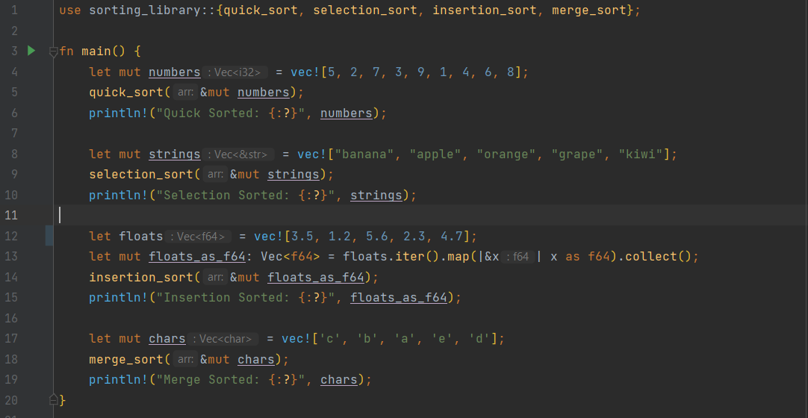

# Sorting Library

## Usage

This Rust library provides various sorting algorithms, including:

- Quick Sort
- Selection Sort
- Insertion Sort
- Merge Sort




To use the sorting algorithms provided by this library, simply import the functions into your Rust project and call them as needed.

```rust
use sorting_library::{quick_sort, selection_sort, insertion_sort, merge_sort};
```

## Examples

Here are some examples demonstrating the usage of sorting algorithms provided by this library:

### Sorting a vector of integers

```rust
use sorting_library::{quick_sort};

fn main() {
    let mut numbers = vec![5, 2, 7, 3, 9, 1, 4, 6, 8];
    quick_sort(&mut numbers);
    println!("Quick Sorted: {:?}", numbers);
}
```

### Sorting a vector of strings

```rust
use sorting_library::{selection_sort};

fn main() {
    let mut strings = vec!["banana", "apple", "orange", "grape", "kiwi"];
    selection_sort(&mut strings);
    println!("Sorted Strings: {:?}", strings);
}
```

### Sorting a vector of floats

```rust
use sorting_library::{insertion_sort};

fn main() {
    let floats = vec![3.5, 1.2, 5.6, 2.3, 4.7];
    let mut floats_as_f64: Vec<f64> = floats.iter().map(|&x| x as f64).collect();
    insertion_sort(&mut floats_as_f64);
    println!("Insertion Sorted: {:?}", floats_as_f64);
}
```

### Sorting a vector of characters

```rust
use sorting_library::{merge_sort};

fn main() {
    let mut chars = vec!['c', 'b', 'a', 'e', 'd'];
    merge_sort(&mut chars);
    println!("Merge Sorted: {:?}", chars);
}
```

